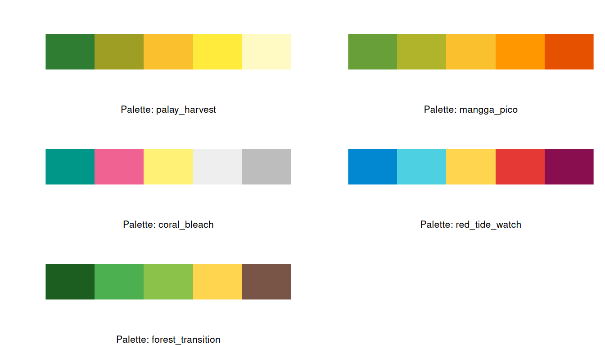
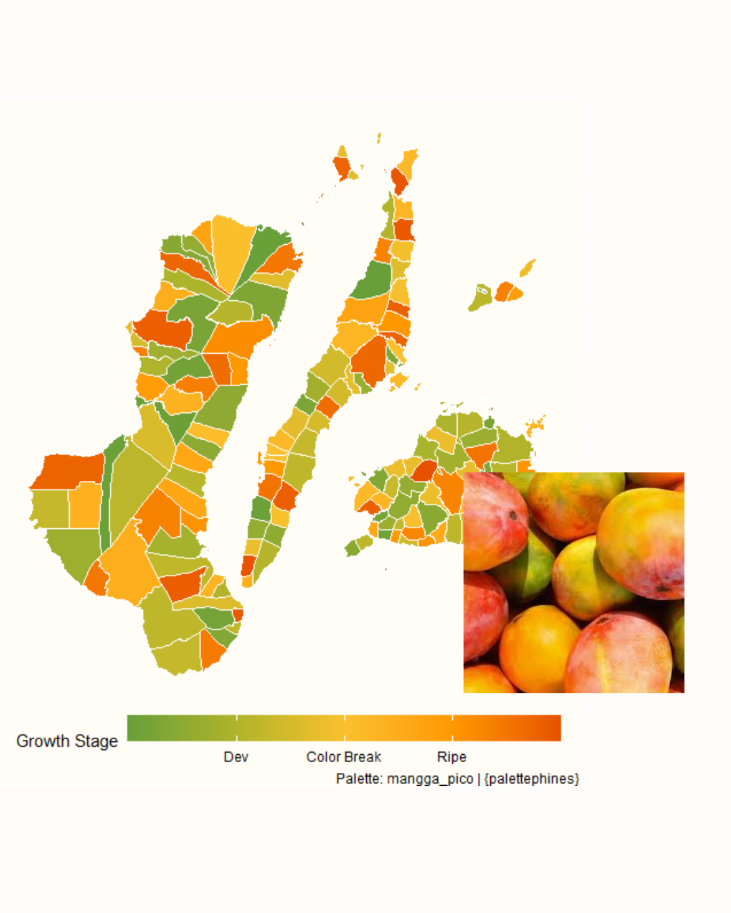
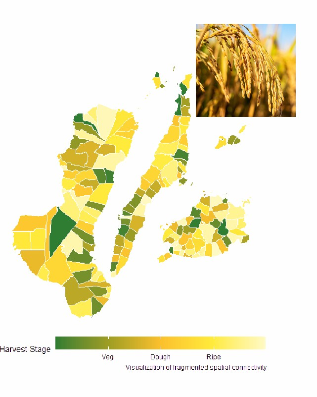

# palettephines: Analytical Color Palettes for Philippine Phenology
[](https://github.com/njtalingting/palettephines/actions)
[](https://cran.r-project.org/web/checks/check_results_palettephines.html)
[](https://CRAN.R-project.org/package=palettephines)


## Overview
In spatial modeling, abstract color gradients (like `viridis`) are essential for perceptual clarity but often fail to provide domain-specific meaning. This package provides topologically grounded scales anchored to international biological standards (BBCH-scale and Reef Health Index). This is for data visualization to resonate with the lived experience of Filipino fishermen, farmers, and other local audience.

> Note: The `palettephines` package is not a replacement for statistical techniques such as Local Indicators of Spatial Association (LISA) and Moran's I but acts as a domain-specific layer. Check out this [vignette](https://pinasr.r-universe.dev/articles/palettephines/palettephines-intro.html) on how to complement this package to standard spatial analytics workflow.
 
## Exploring the Palette
As of v0.1.3, the package covers five (5) major transition in the Philippine bio-economy:

<p align="center">
  
  <br>
  <i><b>Image 1:</b> The five major palette of the palettephines package in R.</i>
</p>

## Application
The primary usage of this package is to transform datasets stuck in spreadsheets into visualizations that could be used for decision-making and communication. Here, we used the `mangga_pico` palette to determine the growth status for each places.

<p align="center">
  
  <br>
  <i><b>Image 2:</b> Visualizing the `mangga_pico` palette in the Philippine map using the `palettephines` package .</i>
</p>

<p align="center">
  
  <br>
  <i><b>Image 2:</b> Visualizing the `palay_harvest` palette in the Philippine map using the `palettephines` package .</i>
</p>

## Installation
You may install the package using:
```
install.packages("palettephines")
```
## Getting Started
```
# 1. Set up required libraries
library(palettephines)
library(ggplot2)

# 2. Capture current settings and setup the layout
# We use no.readonly = TRUE to ensure we only try to reset writeable parameters
oldpar <- par(no.readonly = TRUE) 
par(mfrow = c(3, 2), mar = c(4, 4, 3, 1))

# 3. Call the preview functions
invisible(lapply(names(phines_metadata), function(pal_name) {
  show_phines(pal_name)
}))

# 4. Reset to original user settings
par(oldpar)
```
## Contributions are welcome!
If you want to include a specific palette - from Philippine biomes to your favorite fruit - feel free to create a pull request or submit an issue [here.](https://github.com/pinasr/palettephines/issues)

## References
Meier, U. (2023). Growth stages of mono- and dicotyledonous plants: BBCH Monograph. OpenAgrar. https://www.openagrar.de/servlets/MCRFileNodeServlet/openagrar_derivate_00010428/BBCH-Skala_en.pdf

McField, M., & Kramer, P. R. (2007). Healthy Reefs for Healthy People: A guide to indicators of reef health and social well-being in the Mesoamerican Reef. Healthy Reefs Initiative. https://www.healthyreefs.org

Schwartz, M. W. (2013). Ecological state-transition modeling. In Encyclopedia of Biodiversity (2nd ed.). Springer. https://doi.org/10.1007/978-94-007-6925-0

